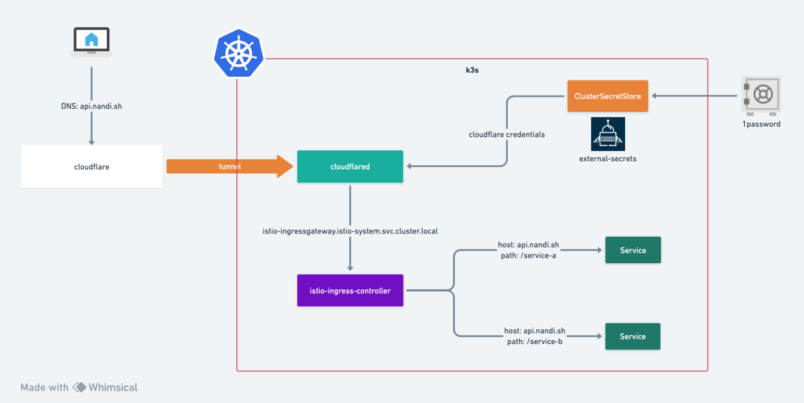

# Homelab Argo Infra

This repository houses the manifests for provisioning the bare-bone infrastructure for the HomeLab project,
consists of
- public ingress with [cloudflare tunnel](https://www.cloudflare.com/products/tunnel/)
- istio mesh
- TBD..




## Prerequisites

Setup the K3S cluster similar to [HomeLab](https://github.com/nandiheath/homelab)

Or alternatively, 
- A Kubernetes cluster
- ArgoCD with `--enable-helm` enabled
- Install [External-Secrets](https://external-secrets.io/latest/) and add the corresponding `ClusterSecretStore` that has access to the 1Password vault

## Directory Structure


```yaml
.
├── kustomize/ # all kustomize manifests
│   ├── bases/ # kustomize bases for every app
│   │   ├── cloudflared/ # kustomize + helm setup. we can add kustomized resources here
│   │   │   ├── values.yaml # customized values file for the helm chart
│   │   │   └── kustomization.yaml # a kustomized Helm Chart pulling from remote source
│   │   └── ...
│   └── overlay/ # overlay for setting cross-cutting fields such as labels
│       └── homelab-rpi-cluster-1/ # per cluster overlay
│           ├── cloudflared/ # pull from the base
│           │   └── kustomization.yaml 
│           └── ...
└── singularity/ # starting point of App of Apps pattern
    └── base/ # being referenced from an explicit ArgoCD app to populate all apps. 
        ├── apps/
        │   └── cloudflared.yaml # argocd app pointing to `/kustomize/overlay/homelab-rpi-cluster-1/cloudflared/`
        ├── argocd-app-patch.yaml # patch default configurations for all argocd applications
        └── kustomization.yaml 
```
